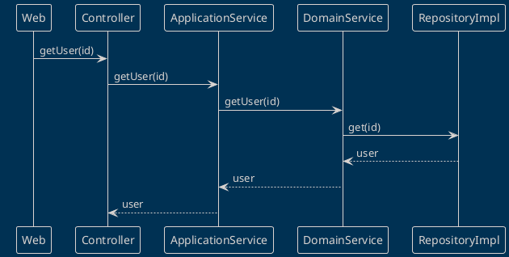
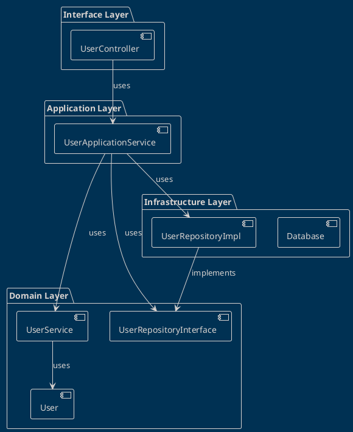

# Domain-Driven Design (DDD) Example in TypeScript

This README provides a detailed explanation of a TypeScript code example that demonstrates the principles of Domain-Driven Design (DDD). DDD is a software design approach that emphasizes a deep understanding and modeling of the application's core domain by creating rich, domain-specific language for developers and domain experts to communicate effectively.

## Table of Contents

- [Domain-Driven Design (DDD) Example in TypeScript](#domain-driven-design-ddd-example-in-typescript)
  - [Table of Contents](#table-of-contents)
  - [Introduction](#introduction)
  - [Requirements and Installation](#requirements-and-installation)
  - [Running the Example](#running-the-example)
  - [Process Overview](#process-overview)
  - [Architecture Overview](#architecture-overview)
  - [Folder Structure](#folder-structure)
    - [Domain Layer](#domain-layer)
      - [User Entity](#user-entity)
      - [Service](#service)
      - [Repository](#repository)
    - [Application Layer](#application-layer)
      - [User Application Service](#user-application-service)
    - [Infrastructure Layer](#infrastructure-layer)
      - [In Memory Database](#in-memory-database)
      - [User Repository Implementation](#user-repository-implementation)
    - [Interfaces Layer](#interfaces-layer)
      - [REST Controller](#rest-controller)
  - [Conclusion](#conclusion)

## Introduction

The main concept of this document is based on "Domain-Driven Design: Tackling Complexity in the Heart of Software" book by Eric Evans.

DDD prioritizes focusing on the core business logic and complex business rules, ensuring that they are properly encapsulated in the domain model and well-modelled using a ubiquitous language that is shared between developers and domain experts.

## Requirements and Installation

This example requires Node.js and TypeScript to be installed on your machine. To install the dependencies, simply run:

```sh
npm install
```

## Running the Example

To run the example, compile the TypeScript code and execute the resulting JavaScript using Node.js, like so:

```sh
tsc && node main.js
```

## Process Overview

The process starts with the REST Controller, which collects input data from the user and transfers it to the Application Service. The Application Service uses domain services and repositories in the Domain Layer to handle the use cases. 

Interaction Diagram:



*The above diagram illustrates the flow of data between the components for a single use case.*

## Architecture Overview

This DDD project comprises four main layers:

1. **Domain Layer**: The heart of the software where all the business logic is implemented. This is where entities, value objects, domain services, and repositories interfaces are defined.
2. **Application Layer**: Defines the jobs the software is supposed to do and directs the expressive domain objects to work out problems. The tasks this layer is responsible for are meaningful to the business.
3. **Infrastructure Layer**: Provides generic technical capabilities that support the layers above.
4. **Interfaces Layer**: This is where the classes responsible for managing the user's interaction with the system are located.

These layers help create a separation of concerns and encapsulate business logic, making the system more understandable, flexible, and maintainable.

Here's a diagram illustrating the dependencies between the layers:



## Folder Structure

The project follows an organized structure, with directories for each layer containing the respective elements of each layer:

```plaintext
my-project/
├── domain/
│   ├── entities/
│   │   └── user.ts
│   ├── services/
│   │   └── user-service.ts
│   └── repositories/
│       └── user-repository.ts
├── application/
│   └── user-application-service.ts
├── infrastructure/
│   └── databases/
│       └── in-memory-database.ts
│   └── repositories/
│       └── user-repository-impl.ts
├── interfaces/
│   ├── contollers/
│   │   └── user-controller.ts
└── main.ts
```

Each of these directories contains the following:

- `domain`: Contains the classes which encompass the core business logic and rules.
- `application`: Contains the application services which coordinate the use cases and direct the domain objects.
- `infrastructure`: Contains the concrete implementations of the technical details (e.g., the database).
- `interfaces`: Contains the controllers that handle the user's interaction with the system.

### Domain Layer

#### User Entity

The user domain entity is a rich model encapsulating the business rules and behaviours associated with the business's concept of a "User". 

```typescript
// user.ts
class User {
  constructor(private id: string, private username: string, private password: string) {}

  // business rules and behavior methods go here
}
```

#### Service

Domain service orchestrates complex operations that involve multiple domain entities. Here we have a User Service that manages User-related operations.

```typescript
// user-service.ts
class UserService {
  constructor(private userRepository: UserRepositoryInterface) {}

  getUser(id: string): User {
    return this.userRepository.getById(id);
  }

  createUser(user: User): void {
    this.userRepository.add(user);
  }
}
```

#### Repository

Repositories are interfaces that represent collections of aggregate roots. In this example, we have a UserRepositoryInterface that provides methods for retrieving and storing User entities.

```typescript
// user-repository.ts
interface UserRepositoryInterface {
  getById(id: string): User;
  add(user: User): void;
}
```

### Application Layer

#### User Application Service

The UserApplicationService is responsible for coordinating use cases that involve the User entity. It bridges the domain and the interfaces layer, using domain services and repositories to handle the business rules.

```typescript
// user-application-service.ts
class UserApplicationService {
  constructor(private userService: UserService) {}

  getUser(id: string): User {
    return this.userService.getUser(id);
  }

  createUser(user: User): void {
    this.userService.createUser(user);
  }
}
```

### Infrastructure Layer

#### In Memory Database

This example features a simple in-memory database implementation as an Infrastructure layer component. The InMemoryDatabase class is a concrete implementation of data persistence operation, acting as a simple data store for User entities.

```typescript
// in-memory-database.ts
class InMemoryDatabase<T> {
  private store: T[] = [];

  getById(id: string): T | undefined {
    return this.store.find((item: any) => item.id === id);
  }

  add(item: T): void {
    this.store.push(item);
  }
}
```

#### User Repository Implementation

Here's a concrete implementation of the UserRepositoryInterface that uses the InMemoryDatabase for the actual data persistence.

```typescript
// user-repository-impl.ts
class UserRepositoryImpl implements UserRepositoryInterface {
  private database: InMemoryDatabase<User>;

  constructor() {
    this.database = new InMemoryDatabase<User>();
  }

  getById(id: string): User {
    return this.database.getById(id);
  }

  add(user: User): void {
    this.database.add(user);
  }
}
```

### Interfaces Layer

#### REST Controller

The REST Controller is part of the interfaces layer that handles HTTP requests, collects input from users and sends responses.

```typescript
// user-controller.ts
class UserController {
  constructor(private userApplicationService: UserApplicationService) {}

  getUser(req: Request, res: Response): void {
    const user = this.userApplicationService.getUser(req.params.id);
    if(user) {
      res.json(user);
    } else {
      res.status(404).send("User not found");
    }
  }

  createUser(req: Request, res: Response): void {
    const user = new User(req.body.id, req.body.username, req.body.password);
    this.userApplicationService.createUser(user);
    res.status(201).send("User created");
  }
}
```

## Conclusion

This TypeScript example demonstrates the principles of Domain-Driven Design (DDD) by structuring the code into distinct layers and following an approach that focuses on a rich, collaboration-oriented domain model. By following these principles, the codebase becomes more maintainable, the communication between the development team and the domain experts improves, and the complexity of the business rules is better managed.